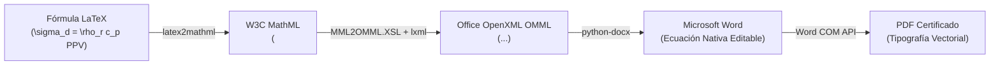

# 🎓 Sistema Agéntico de Tesis y Metodología de Investigación (UNI FIGMM)

[](https://www.python.org/)
[](https://opensource.org/licenses/MIT)
[-orange.svg)](https://figmm.uni.edu.pe)
[](docs/metodologia_investigacion/00_INDICE_GRAFO_CONOCIMIENTO.md)
[](AGENTS.md)

Repositorio científico y portable para el desarrollo automatizado, auditado y matemáticamente fundamentado de **Planes de Tesis y Tesis de Posgrado** para la Sección de Posgrado de la **Facultad de Ingeniería Geológica, Minera y Metalúrgica de la Universidad Nacional de Ingeniería (UNI - FIGMM)**.

El sistema integra un **equipo de agentes de inteligencia artificial especializados** (Antigravity / Gemini CLI), **Google Deep Research en NotebookLM** como fuente primaria de verdad y un **motor de compilación en Microsoft Word COM** con renderizado nativo de ecuaciones matemáticas OMML (Cambria Math).

---

## 🏛️ Caso de Estudio Principal
* **Título:** *"Aplicación del Q system de Barton y el monitoreo de vibraciones para optimizar la selección del sostenimiento dinámico para una unidad minera en el centro del Perú, 2026"*
* **Unidad de Estudio:** Labores de avance mecanizado en la U.E.A. Minera Lincuna (Áncash, Perú).
* **Entregables Finales Generados:**
  - 📄 **Marco Teórico Certificado (21 páginas físicas en Word):** [`output/CAP_II_MARCO_TEORICO_Q_VIBRACIONES_SOSTENIMIENTO_DINAMICO_FINAL.docx`](output/CAP_II_MARCO_TEORICO_Q_VIBRACIONES_SOSTENIMIENTO_DINAMICO_FINAL.docx)
  - 📕 **Documento PDF Oficial:** [`output/CAP_II_MARCO_TEORICO_Q_VIBRACIONES_SOSTENIMIENTO_DINAMICO_FINAL.pdf`](output/CAP_II_MARCO_TEORICO_Q_VIBRACIONES_SOSTENIMIENTO_DINAMICO_FINAL.pdf)
  - 📊 **Matriz de Consistencia Metodológica 5x4:** [`output/02_MATRIZ_DE_CONSISTENCIA.md`](output/02_MATRIZ_DE_CONSISTENCIA.md)

---

## 📂 Estructura del Proyecto (Software Engineering Best Practices)

El proyecto está organizado de forma modular, portable y reproducible:

```text
tesisnotebook/
├── .agents/                               # Configuración de Agentes para Antigravity CLI
│   ├── agents/                            # 8 Subagentes especializados (Teorico, Auditor, etc.)
│   ├── rules/                             # Reglas de operación (NotebookLM Deep Research)
│   └── skills/                            # Habilidades ejecutables (teorico, notebooklm)
├── .gemini/                               # Compatibilidad nativa para Gemini CLI
│   ├── agents/                            # Copia espejo de subagentes
│   ├── rules/                             # Reglas de sesión y grounding
│   └── skills/                            # Skills de consulta y extracción
├── docs/                                  # Documentación técnica y académica
│   ├── metodologia_investigacion/         # 🧠 GRAFO DE CONOCIMIENTO (Obsidian / Wikilinks)
│   │   ├── 00_INDICE_GRAFO_CONOCIMIENTO.md
│   │   ├── 01_EPISTEMOLOGIA_Y_REGLAS_DE_ORO.md
│   │   ├── 02_DECONSTRUCCION_DEL_TITULO.md
│   │   ├── 03_DEDUCCION_PROBLEMAS_OBJETIVOS_HIPOTESIS.md
│   │   ├── 04_OPERACIONALIZACION_DE_VARIABLES.md
│   │   ├── 05_ARQUITECTURA_MATRIZ_CONSISTENCIA.md
│   │   ├── 06_GUIA_FORMATO_1_PLAN_TESIS_UNI.md
│   │   └── 07_RUNBOOK_AGENTE_IA_CONSISTENCIA.md
│   └── prompts/                           # Prompts de desarrollo e instrucciones históricas
├── inputs/                                # Datos crudos y fuentes de entrada
│   ├── Data disponible/                   # Bases de datos de perforación y voladura en Excel
│   ├── lineamientos/                      # Formatos oficiales FIGMM y resoluciones rectorales
│   └── *.docx, *.txt                      # Documentos de referencia y tesis previas
├── knowledge_base/                        # Base de conocimiento estructurada
│   ├── 01_metodologia_grounding.md        # Transcripción de cátedras UNI (Barrutia / Martínez)
│   ├── 02_tesis_empirica_grounding.md     # Datos empíricos de voladura y fragmentación
│   └── 04_parametros_mina_lincuna.md      # Parámetros geomecánicos de la unidad minera
├── output/                                # Entregables generados y certificados
│   ├── *.docx, *.pdf                      # Documentos finales en Word y PDF
│   └── audit_pages/                       # Auditoría visual PNG de páginas y fórmulas
├── src/                                   # Código fuente y scripts de compilación
│   ├── skills/                            # Motores de ensamblado, OMML y consistencia
│   │   ├── build_marco_teorico_docx_final.py  # Script maestro de compilación del Marco Teórico
│   │   └── matrix_consistency_auditor.py      # Auditor semántico de consistencia 1:1
│   └── tools/                             # Utilidades y diagnósticos
├── AGENTS.md                              # Reglas obligatorias para el agente IA
├── GEMINI.md                              # Reglas de operación en Gemini CLI
├── requirements.txt                       # Dependencias de Python
└── README.md                              # Guía general de uso y navegación
```

---

## 🤖 El Ecosistema de Subagentes Especializados

Ubicados en [`.agents/agents/`](.agents/agents/) y [`.gemini/agents/`](.gemini/agents/):

| Subagente | Rol y Responsabilidad |
| :--- | :--- |
| **`auditor_cumplimiento`** | Auditor imparcial y riguroso de prompts, directivas, enlaces a Drive y notas de NotebookLM. |
| **`agente_drive_notebooklm`** | Especialista en integración y sincronización de Google Drive (Playwright) y Google NotebookLM (MCP/Deep Research). |
| **`Teorico`** | Redactor de bases teóricas y definiciones conceptuales. Consulta exclusivamente a Google NotebookLM y aplica normas de deducción científica. |
| **`InvestigadorTeorico`** | Especialista en búsqueda e ingesta de artículos en Scopus / Web of Science mediante NotebookLM Deep Research. |
| **`agente_auditor_plan_uni`** | Auditor de conformidad metodológica. Valida el cumplimiento del estándar UNI FIGMM y la metodología de la Dra. Rosario Martínez. |
| **`jurado_calificador_uni`** | Simula a los miembros del jurado evaluador de la FIGMM (Presidente, Secretario, Vocal), emitiendo dictámenes críticos antes de la entrega oficial. |
| **`auditor_cumplimiento_prompt`** | Verifica que no se hayan omitido restricciones (extensión, formato de fórmulas, referencias APA 7ma, numeración). |
| **`auditor_qaqc_vision_humana`** | Realiza la auditoría visual mediante renderizado de páginas en alta resolución (PyMuPDF) para validar tipografía y renderizado de fórmulas. |
| **`tesis-generator-50p`** | Ensamblador de planes de tesis extensos (≥ 50 páginas) cumpliendo la estructura canónica de la UNI. |
| **`esceptico_auditor`** | Auditor contradictor que desafía los cálculos geomecánicos y busca inconsistencias estadísticas o mecánicas. |

---

## 🧠 Grafo de Conocimiento Metodológico (Dra. Rosario Martínez)

En la carpeta [`docs/metodologia_investigacion/`](docs/metodologia_investigacion/) se encuentra el sistema completo de deducción científica en formato compatible con **Obsidian** y lectores de Markdown:

1. **[[01_EPISTEMOLOGIA_Y_REGLAS_DE_ORO|01. Epistemología y Reglas de Oro]]:** Paradigma cuantitativo aplicado, deductivo y las 7 reglas de oro de la investigación.
2. **[[02_DECONSTRUCCION_DEL_TITULO|02. Deconstrucción del Título]]:** Algoritmo de parsing para extraer $X$ (aporte), $Y$ (finalidad), $Z$ (contexto) y delimitación.
3. **[[03_DEDUCCION_PROBLEMAS_OBJETIVOS_HIPOTESIS|03. Deducción de Problemas, Objetivos e Hipótesis]]:** La regla de correspondencia biunívoca 1:1 y taxonomía de verbos de acción.
4. **[[04_OPERACIONALIZACION_DE_VARIABLES|04. Operacionalización de Variables]]:** Dimensiones, indicadores cuantificables en unidades físicas y escalas de medición.
5. **[[05_ARQUITECTURA_MATRIZ_CONSISTENCIA|05. Arquitectura de la Matriz de Consistencia]]:** Cuadrícula 5x4 y pruebas de consistencia horizontal y vertical.
6. **[[06_GUIA_FORMATO_1_PLAN_TESIS_UNI|06. Guía Normativa Formato 1]]:** Desarrollo reglamentario de los 8 ítems para inscripción formal ante la Comisión de Grados y Títulos.
7. **[[07_RUNBOOK_AGENTE_IA_CONSISTENCIA|07. Runbook para Agentes de IA]]:** Pipeline determinístico, esquemas JSON y prompts para automatizar la generación sin alucinaciones.

---

## 🚀 Guía de Instalación y Uso Rápido

### 1. Clonar el Repositorio
```bash
git clone https://github.com/chihuacoaudaz-png/tesisnotebook.git
cd tesisnotebook
```

### 2. Instalar Dependencias
Se recomienda utilizar un entorno virtual de Python 3.10 o superior:
```bash
python -m venv venv
venv\Scripts\activate      # En Windows
pip install -r requirements.txt
playwright install chromium
```

### 3. Autenticar Sesión Google (NotebookLM + Drive)
Para habilitar la sincronización con los cuadernos científicos y Google Drive:
```bash
notebooklm login
```
*Esto abrirá una ventana de Chromium para conectar tu cuenta de Google (`chihuacoaudaz@gmail.com`). Una vez iniciada sesión, las credenciales se guardarán automáticamente en `~/.notebooklm/profiles/default/storage_state.json`.*

### 4. Cuadernos Oficiales del Proyecto
* **Cuaderno de Metodología de Posgrado:** `Marco Metodologico de Posgrado UNI FIGMM - Dra. Rosario Martinez` (`769227ea-9b15-4fbc-a382-b14cd5e7435f`).
* **Cuaderno Núcleo Tesis Lincuna 2026:** `Tesis: Sistema Agentico de P&V y Control de Sobrerotura - Minera Lincuna 2026` (`780ac1ad-e15b-4801-be5e-44131370dfbc`).
* **Cuaderno Histórico Geomecánica:** `Tesis: Q-System Barton y Monitoreo de Vibraciones para Sostenimiento Dinamico` (`772eae6c-564b-4430-826e-8d3b8d14dcb4`).

Para consultar el cuaderno desde la consola:
```bash
notebooklm ask "¿Cuáles son los 8 ítems normativos del Plan de Tesis Formato 1?" -n 769227ea-9b15-4fbc-a382-b14cd5e7435f
```

### 5. Carga y Sincronización con Google Drive
Para subir las 25 tesis del benchmark a la carpeta `AGENTE TESIS/TESIS PARA SCRAPEAR INDICE` utilizando la sesión de Playwright (evitando errores OAuth 403 `restricted_client`):
```bash
python src/tools/upload_theses_to_drive.py
# O para archivos arbitrarios:
python src/tools/drive_uploader.py --dir "data/scraped_theses" --pattern "*.pdf"
```

> 📖 Para una guía exhaustiva de despliegue en cualquier PC de trabajo, consulta la [**Guía Maestra de Portabilidad y Despliegue**](docs/GUIA_PORTABILIDAD_Y_DESPLIEGUE.md).

### 6. Compilar el Documento Final en Word y PDF
Para compilar el Marco Teórico con ecuaciones nativas OMML (Cambria Math) y verificar las 21 páginas físicas:
```bash
python src/skills/build_marco_teorico_docx_final.py
```

---

## 🔬 Motor de Ecuaciones Matemáticas Nativas (LaTeX ➔ MathML ➔ OMML)

A diferencia de generadores comunes que insertan imágenes borrosas o texto plano, este sistema utiliza la hoja de estilo oficial de Microsoft Office ([`MML2OMML.XSL`](C:/Program%20Files/Microsoft%20Office/root/Office16/MML2OMML.XSL)):



El resultado en Word es una ecuación perfectamente integrada al flujo de texto en fuente **Cambria Math**, editable directamente con el teclado (`Alt + =`).

---

## 👥 Colaboración y Contribución

Este repositorio está preparado para ser revisado por pares académicos, jurados evaluadores de tesis y desarrolladores de sistemas agénticos. Para sugerencias o extensiones:
1. Crear un branch temático (`git checkout -b feature/nueva-metodologia`).
2. Realizar los cambios y validar las compuertas de calidad en [`matrix_consistency_auditor.py`](src/skills/matrix_consistency_auditor.py).
3. Abrir un Pull Request detallando la trazabilidad con los cuadernos de NotebookLM.

---
*Sección de Posgrado - Facultad de Ingeniería Geológica, Minera y Metalúrgica (UNI FIGMM)*  
*Lima, Perú - 2026*
