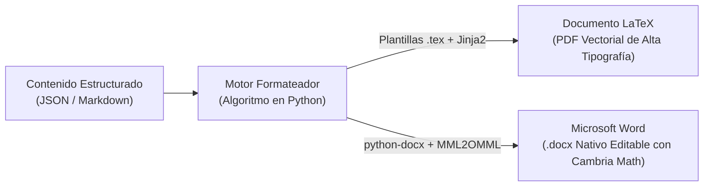

# 🤖 Especificación de Esquema JSON para el Agente Formateador

Este documento define la arquitectura de datos y el **Esquema JSON (JSON Schema v2020-12)** que el Agente Formateador consumirá como entrada neutral para generar de manera determinística los entregables finales en **LaTeX** (PDF vía MiKTeX/TeXLive) y **Microsoft Word** (`.docx` con ecuaciones nativas OMML vía `python-docx`).

---

## 🏗️ Filosofía de Diseño: Separación de Contenido y Presentación



1. **Agnóstico al formato final:** El archivo JSON contiene exclusivamente los textos, metadatos, tablas, fórmulas matemáticas en sintaxis LaTeX y rutas de figuras.
2. **Cero formateo hardcoded en el texto:** Las tipografías, interlineados, márgenes y numeraciones las define el compilador según la normativa de la UNI FIGMM.
3. **Soporte matemático bidireccional:** Las ecuaciones se almacenan como cadenas LaTeX puras. El motor las inyecta directamente en LaTeX o las convierte a OMML en Word.

---

## 📜 JSON Schema Formal (`documento_academico_schema.json`)

```json
{
  "$schema": "https://json-schema.org/draft/2020-12/schema",
  "title": "DocumentoAcademicoUNIFIGMM",
  "type": "object",
  "required": ["metadatos", "tipo_documento", "cuerpo"],
  "properties": {
    "tipo_documento": {
      "type": "string",
      "enum": ["plan_tesis", "tesis_completa", "articulo_cientifico", "informe_minero"],
      "description": "Define el template y las reglas de maquetación"
    },
    "metadatos": {
      "type": "object",
      "required": ["titulo", "autor", "universidad", "facultad", "escuela", "grado_optado", "ano", "ciudad"],
      "properties": {
        "titulo": { "type": "string" },
        "autor": {
          "type": "object",
          "required": ["nombres_apellidos"],
          "properties": {
            "nombres_apellidos": { "type": "string" },
            "codigo_uni": { "type": "string" },
            "dni": { "type": "string" },
            "correo": { "type": "string" },
            "orcid": { "type": "string" }
          }
        },
        "asesor": {
          "type": "object",
          "properties": {
            "nombres_apellidos": { "type": "string" },
            "grado_academico": { "type": "string" },
            "orcid": { "type": "string" }
          }
        },
        "universidad": { "type": "string", "default": "Universidad Nacional de Ingeniería" },
        "facultad": { "type": "string", "default": "Facultad de Ingeniería Geológica, Minera y Metalúrgica" },
        "escuela": { "type": "string", "enum": ["Ingeniería de Minas", "Ingeniería Geológica", "Ingeniería Metalúrgica"] },
        "grado_optado": { "type": "string", "default": "Título Profesional de Ingeniero de Minas" },
        "ano": { "type": "integer" },
        "ciudad": { "type": "string", "default": "Lima - Perú" }
      }
    },
    "preliminares": {
      "type": "object",
      "properties": {
        "dedicatoria": { "type": "string" },
        "agradecimientos": { "type": "string" },
        "resumen_es": { "type": "string" },
        "abstract_en": { "type": "string" },
        "palabras_clave": { "type": "array", "items": { "type": "string" } },
        "keywords": { "type": "array", "items": { "type": "string" } }
      }
    },
    "cuerpo": {
      "type": "array",
      "description": "Lista secuencial de Capítulos o Secciones Troncales",
      "items": {
        "$ref": "#/$defs/Capitulo"
      }
    },
    "terminales": {
      "type": "object",
      "properties": {
        "conclusiones": { "type": "array", "items": { "type": "string" } },
        "recomendaciones": { "type": "array", "items": { "type": "string" } },
        "referencias_bibliograficas": {
          "type": "array",
          "items": {
            "type": "object",
            "required": ["cita_completa_apa"],
            "properties": {
              "id": { "type": "string" },
              "cita_completa_apa": { "type": "string" },
              "doi": { "type": "string" }
            }
          }
        },
        "anexos": {
          "type": "array",
          "items": {
            "type": "object",
            "required": ["numero", "titulo", "contenido"],
            "properties": {
              "numero": { "type": "string" },
              "titulo": { "type": "string" },
              "contenido": { "type": "string" }
            }
          }
        }
      }
    }
  },
  "$defs": {
    "Capitulo": {
      "type": "object",
      "required": ["numero_romano", "titulo", "secciones"],
      "properties": {
        "numero_romano": { "type": "string", "example": "I" },
        "titulo": { "type": "string", "example": "Parte introductoria del trabajo" },
        "secciones": {
          "type": "array",
          "items": { "$ref": "#/$defs/Seccion" }
        }
      }
    },
    "Seccion": {
      "type": "object",
      "required": ["numeracion", "titulo", "bloques"],
      "properties": {
        "numeracion": { "type": "string", "example": "1.2.1" },
        "titulo": { "type": "string", "example": "Problema general" },
        "bloques": {
          "type": "array",
          "items": { "$ref": "#/$defs/BloqueContenido" }
        },
        "subsecciones": {
          "type": "array",
          "items": { "$ref": "#/$defs/Seccion" }
        }
      }
    },
    "BloqueContenido": {
      "type": "object",
      "required": ["tipo"],
      "properties": {
        "tipo": {
          "type": "string",
          "enum": ["parrafo", "ecuacion", "tabla", "figura", "lista", "codigo"]
        },
        "texto": { "type": "string" },
        "latex_math": { "type": "string", "description": "Código LaTeX puro sin delimitadores $$" },
        "label": { "type": "string", "description": "Identificador para referencias cruzadas (eq:..., tab:..., fig:...)" },
        "caption": { "type": "string" },
        "fuente": { "type": "string" },
        "columnas": { "type": "array", "items": { "type": "string" } },
        "filas": { "type": "array", "items": { "type": "array", "items": { "type": "string" } } },
        "alineacion": { "type": "array", "items": { "type": "string", "enum": ["left", "center", "right"] } },
        "ruta_imagen": { "type": "string" },
        "ancho_pct": { "type": "number", "minimum": 10, "maximum": 100 },
        "items": { "type": "array", "items": { "type": "string" } },
        "estilo_lista": { "type": "string", "enum": ["vinetas", "numerada"] },
        "lenguaje_codigo": { "type": "string", "example": "python" }
      }
    }
  }
}
```

---

## 💻 Ejemplo Mínimo Concreto de Entrada JSON

```json
{
  "tipo_documento": "plan_tesis",
  "metadatos": {
    "titulo": "DETERMINACIÓN DE UN MODELO MATEMÁTICO ESPECÍFICO PARA LA PREDICCIÓN DE LA FRAGMENTACIÓN DE ROCA MEDIANTE MACHINE LEARNING EN UNA MINA EN EL SUR",
    "autor": {
      "nombres_apellidos": "César Contreras Ansieta",
      "codigo_uni": "20180001A",
      "dni": "70000000",
      "correo": "cesar.contreras@uni.pe"
    },
    "universidad": "Universidad Nacional de Ingeniería",
    "facultad": "Facultad de Ingeniería Geológica, Minera y Metalúrgica",
    "escuela": "Ingeniería de Minas",
    "grado_optado": "Título Profesional de Ingeniero de Minas",
    "ano": 2026,
    "ciudad": "Lima - Perú"
  },
  "cuerpo": [
    {
      "numero_romano": "I",
      "titulo": "Planteamiento de la Realidad Problemática",
      "secciones": [
        {
          "numeracion": "1.1",
          "titulo": "Descripción de la realidad problemática",
          "bloques": [
            {
              "tipo": "parrafo",
              "texto": "Lograr una fragmentación de roca óptima es el punto de partida que dicta la eficiencia energética de todo el proceso de conminución..."
            }
          ]
        },
        {
          "numeracion": "1.2",
          "titulo": "Formulación del problema",
          "subsecciones": [
            {
              "numeracion": "1.2.1",
              "titulo": "Problema general",
              "bloques": [
                {
                  "tipo": "parrafo",
                  "texto": "¿En qué medida el desarrollo de un modelo matemático basado en la jerarquización de variables por Machine Learning permite mejorar la precisión de las predicciones de fragmentación de roca en una unidad minera del sur?"
                }
              ]
            }
          ]
        }
      ]
    }
  ],
  "terminales": {
    "referencias_bibliograficas": [
      {
        "id": "cunningham2005",
        "cita_completa_apa": "Cunningham, C. V. B. (2005). The Kuz-Ram fragmentation model – 20 years on. Proceedings of the 3rd EFEE Conference on Explosives and Blasting, 201–210."
      }
    ]
  }
}
```

---

## ⚙️ Guía de Implementación para el Programador (Python)

Tu colega puede utilizar esta plantilla base para renderizar el JSON hacia ambos mundos:

### Mapeo a LaTeX (usando Jinja2):
* `metadatos.titulo` $\rightarrow$ `\title{...}`
* `Capitulo` $\rightarrow$ `\chapter{...}`
* `Seccion` (nivel 1) $\rightarrow$ `\section{...}`
* `Seccion` (nivel 2) $\rightarrow$ `\subsection{...}`
* `Seccion` (nivel 3) $\rightarrow$ `\subsubsection{...}`
* Bloque `ecuacion` $\rightarrow$ `\begin{equation} \label{...} ... \end{equation}`
* Bloque `tabla` $\rightarrow$ `\begin{table}[htbp] \centering \caption{...} ... \end{table}`
* Bloque `figura` $\rightarrow$ `\begin{figure}[htbp] \centering \includegraphics[width=...]{...} \caption{...} \end{figure}`

### Mapeo a Word (usando `python-docx` + `latex2mathml` + `MML2OMML.XSL`):
* `Capitulo` $\rightarrow$ `doc.add_heading('CAPÍTULO I...', level=1)`
* `Seccion` $\rightarrow$ `doc.add_heading('1.2...', level=2)`
* Bloque `parrafo` $\rightarrow$ `p = doc.add_paragraph(b['texto'])` con estilo justificado e interlineado 1.15.
* Bloque `ecuacion` $\rightarrow$ Convertir `latex_math` mediante `latex2mathml` $\rightarrow$ `MML2OMML.XSL` $\rightarrow$ Inyectar nodo XML `<m:oMath>` directamente en el párrafo centrado de Word.
* Bloque `tabla` $\rightarrow$ `table = doc.add_table(rows, cols)` aplicando fondo azul UNI `#1F4E79` en el header y bordes formales.
