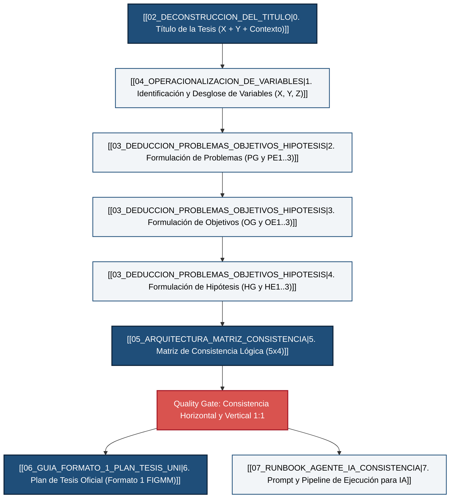

# 🧠 Grafo de Conocimiento: Metodología de Investigación para Tesis de Posgrado (UNI - FIGMM)

Este módulo documenta el flujo epistemológico, deductivo y formal para formular la arquitectura de investigación de cualquier plan de tesis en ingeniería geológica, minera y metalúrgica, conforme a las cátedras de la **Dra. Rosario Martínez**, el **Dr. Walter Barrutia Feijóo** y los lineamientos oficiales de la **FIGMM - UNI**.

---

## 🗺️ Mapa de Navegación del Grafo (Obsidian / Wikilinks)

---

## 📚 Módulos del Grafo de Conocimiento

| # | Archivo | Propósito Metodológico |
| :--- | :--- | :--- |
| **01** | [[01_EPISTEMOLOGIA_Y_REGLAS_DE_ORO\|01. Epistemología y Reglas de Oro]] | Fundamentos de investigación cuantitativa, aplicada, deductiva y reglas inviolables de consistencia de la Dra. Rosario Martínez. |
| **02** | [[02_DECONSTRUCCION_DEL_TITULO\|02. Deconstrucción del Título]] | Algoritmo formal para analizar y redactar el título: $[X] + [Y] + [Z] + [\text{Unidad de Estudio}] + [\text{Tiempo}]$. |
| **03** | [[03_DEDUCCION_PROBLEMAS_OBJETIVOS_HIPOTESIS\|03. Deducción de Problemas, Objetivos e Hipótesis]] | Regla de correspondencia biunívoca 1:1, taxonomía de verbos de acción y descomposición lógica tridimensional. |
| **04** | [[04_OPERACIONALIZACION_DE_VARIABLES\|04. Operacionalización de Variables]] | Matriz canónica de dimensiones, indicadores métricos, escalas de medición e instrumentos de campo. |
| **05** | [[05_ARQUITECTURA_MATRIZ_CONSISTENCIA\|05. Arquitectura de la Matriz de Consistencia]] | Estructura matricial 5x4, pruebas de coherencia cruzada y compuertas de calidad. |
| **06** | [[06_GUIA_FORMATO_1_PLAN_TESIS_UNI\|06. Guía Formato 1 Plan de Tesis UNI]] | Estructura normativa de los 8 ítems reglamentarios de la FIGMM (Resolución Rectoral). |
| **07** | [[07_RUNBOOK_AGENTE_IA_CONSISTENCIA\|07. Runbook para Agentes de IA]] | Pipeline algorítmico en pseudo-código y JSON schema para que cualquier LLM genere matrices sin alucinaciones. |

---

## 🎯 Principio Rector: Cero Alucinación e Hiper-Alineación

1. **Sin invenciones:** Ningún objetivo o problema específico puede surgir fuera de las dimensiones operacionales de las variables identificadas en el título.
2. **Sin actividades operativas:** Los objetivos de investigación representan **logros cognitivos o aportes de conocimiento**, nunca tareas rutinarias de campo como *"recopilar datos"* o *"visitar la mina"*.
3. **Correspondencia Biunívoca Rigurosa:**
   $$\text{PG} \iff \text{OG} \iff \text{HG}$$
   $$\text{PE}_i \iff \text{OE}_i \iff \text{HE}_i \quad (\forall i \in \{1, 2, 3\})$$
