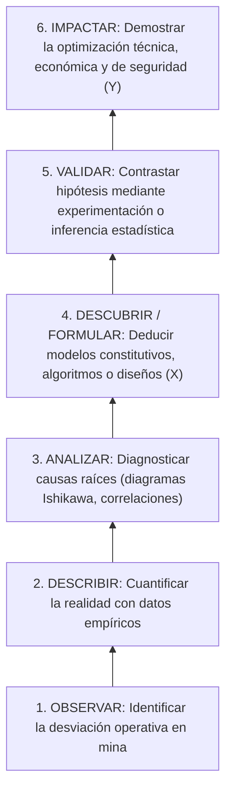

# 🏛️ Epistemología y Reglas de Oro Metodológicas (UNI - FIGMM)

## 1. Naturaleza Epistemológica de la Investigación en Ingeniería (UNI FIGMM)

Conforme a las directrices de la Sección de Posgrado de la Facultad de Ingeniería Geológica, Minera y Metalúrgica (FIGMM - UNI) impartidas por la **Dra. Rosario Martínez** y el **Dr. Walter Barrutia Feijóo**, toda investigación de tesis o trabajo de suficiencia profesional debe enmarcarse en el paradigma **cuantitativo, aplicado y tecnológico**:

| Característica | Enfoque Cualitativo (No aplicable a tesis técnica) | Enfoque Cuantitativo (Estándar Exigido UNI) |
| :--- | :--- | :--- |
| **Percepción de la realidad** | Subjetiva, incluyente. | **Objetiva, excluyente, empíricamente comprobable.** |
| **Razonamiento** | Inductivo, generador de conjeturas. | **Deductivo, contrastador formal de hipótesis.** |
| **Finalidad** | Exploración y descubrimiento cualitativo. | **Comprobación, confirmación, optimización y reducción de incertidumbre.** |
| **Orientación** | Al proceso descriptivo. | **Al resultado y al aporte ingenieril medible.** |
| **Principio de verdad** | Provisorio, dinámico. | **Estable, falsable mediante pruebas estadísticas o modelos matemáticos.** |
| **Perspectiva del investigador**| Desde dentro (inmerso subjetivamente). | **Desde afuera (al margen de los datos, rigor instrumental).** |
| **Causalidad** | Interacción holística multicausal. | **Relación causa-efecto ($X \rightarrow Y$) con control de variables ($Z$).** |

---

## 2. La Escalera del Conocimiento Científico

En ingeniería de minas, el investigador asciende progresivamente los peldaños de la escalera del conocimiento:

---

## 3. Las 7 Reglas de Oro Inviolables de la Dra. Rosario Martínez

Cualquier agente de IA o evaluador académico debe someter el proyecto a estas 7 pruebas:

### ⚡ Regla 1: Unicidad de la Variable Dependiente ($Y$)
* En una tesis de ingeniería, la **Variable Dependiente ($Y$) es ÚNICA**.
* Representa la *finalidad principal de la investigación* o el *problema central que se busca resolver* (ej. optimizar la fragmentación de roca, reducir la sobrerotura, o maximizar la absorción de energía del sostenimiento dinámico).
* **Error fatal:** Colocar múltiples variables dependientes desvinculadas (ej. *"optimizar la fragmentación, reducir los costos de transporte y mejorar la ventilación"*). Si hay varios beneficios, estos son *indicadores o dimensiones de una sola variable de rendimiento o estabilidad*.

### ⚡ Regla 2: El Aporte del Investigador es la Variable Independiente ($X$)
* La **Variable Independiente ($X$)** es el *aporte del investigador* o la *variable experimental*.
* Es la causa manipulada o el sistema propuesto (ej. aplicación del Sistema Q de Barton acoplado a monitoreo de vibraciones, algoritmo de machine learning, diseño de precorte).
* Puede descomponerse en dos o tres dimensiones operacionales complementarias (ej. caracterización geomecánica + diseño de energía).

### ⚡ Regla 3: Correspondencia Biunívoca Estricta (1 a 1)
* La estructura no puede tener "cabos sueltos":
  $$\text{Cantidad de Problemas} = \text{Cantidad de Objetivos} = \text{Cantidad de Hipótesis}$$
* Si existen 1 Problema General y 3 Problemas Específicos:
  - Habrá exactamente **1 Objetivo General** y **3 Objetivos Específicos**.
  - Habrá exactamente **1 Hipótesis General** y **3 Hipótesis Específicas**.
* El problema $i$, el objetivo $i$ y la hipótesis $i$ abordan exactamente el mismo núcleo semántico y las mismas variables.

### ⚡ Regla 4: Prohibición de Verbos Operativos en los Objetivos
* Los objetivos se inician con un **verbo de acción en infinitivo** que denote un **logro cognitivo o de investigación**.
* **Verbos Prohibidos (Simples tareas de oficina o campo):**
  - ❌ *"Recopilar datos de perforación"*
  - ❌ *"Realizar visitas al yacimiento"*
  - ❌ *"Revisar la literatura existente"*
  - ❌ *"Calibrar el sismógrafo"*
* **Verbos Exigidos (Taxonomía aplicada):**
  - ✅ **Caracterizar** (diagnóstico del macizo rocoso o línea base)
  - ✅ **Modelar / Formular / Desarrollar** (construcción del algoritmo o diseño matemático)
  - ✅ **Evaluar / Optimizar / Determinar** (análisis del impacto en la variable dependiente)
  - ✅ **Validar / Contrastar** (comprobación experimental o estadística)

### ⚡ Regla 5: Preguntas Abiertas en la Formulación del Problema
* El problema NUNCA debe formularse como una pregunta dicotómica (de respuesta "sí" o "no").
  - ❌ *¿El sistema de pernos dinámicos reduce el desprendimiento de roca?* (Respuesta trivial: Sí).
  - ✅ *¿En qué medida la aplicación del Sistema Q de Barton y el monitoreo de vibraciones optimiza la selección del sostenimiento dinámico en...?*

### ⚡ Regla 6: Hipótesis como Proposición Falsable y Condicional
* La hipótesis es una respuesta tentativa y afirmativa que relaciona causalmente $X$ con $Y$.
* Debe ser redactada de forma que pueda ser sometida a prueba empírica mediante recolección de datos y contrastación inferencial ($t$-Student, ANOVA, $R^2$, RMSE, etc.).

### ⚡ Regla 7: Trazabilidad Total y Lenguaje Impersonal
* Redacción en tercera persona singular o voz pasiva impersonal (ej. *"se determinó"*, *"se evaluó"*). Prohibido el uso de primera persona (ni singular *"yo determiné"* ni plural *"nosotros evaluamos"*).
* Oraciones breves, técnicas y directas (máximo 4 a 5 líneas por párrafo antes de conectar con datos).
* Toda afirmación empírica debe estar respaldada por citas bibliográficas formales (APA 7ma / IEEE) o registros de instrumentación certificados.
