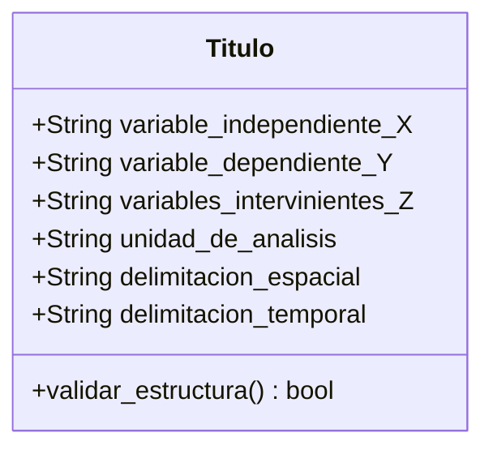

# 🏷️ Deconstrucción y Formulación del Título de Tesis

## 1. La Fórmula Canónica del Título (UNI FIGMM)

Según las directivas del Dr. Walter Barrutia y la Dra. Rosario Martínez, el título de una tesis de ingeniería debe ser:
1. **Breve:** Evitar redundancias y palabras vacías (*"Un estudio sobre..."*, *"Investigación acerca de..."*).
2. **Impersonal:** Términos estrictamente técnicos.
3. **Refleja la Contribución:** El aporte del investigador (Variable Independiente $X$).
4. **Refleja el Objetivo:** La finalidad práctica que resuelve el problema (Variable Dependiente $Y$).
5. **Refleja Identidad Diferenciadora:** La unidad de análisis y delimitación operativa.

### Ecuación Estructural del Título:
$$\text{Título} = \underbrace{[X]}_{\text{Aporte del Investigador}} + \underbrace{\text{[Conector Causal]}}_{\text{para optimizar / evaluar}} + \underbrace{[Y]}_{\text{Finalidad / Problema}} + \underbrace{[\text{Sujeto / Unidad de Análisis}]}_{\text{Mina / Yacimiento / Planta}} + \underbrace{[\text{Espacio y Tiempo}]}_{\text{Ubicación y Año}}$$

---

## 2. Componentes Ontológicos del Título



1. **Variable Independiente ($X$ - Causa / Aporte):**
   - Es la tecnología, modelo analítico, metodología o diseño que el investigador introduce en el sistema.
   - *Ejemplo:* "Aplicación del Sistema Q de Barton y el monitoreo de vibraciones".
2. **Variable Dependiente ($Y$ - Efecto / Finalidad):**
   - Es el comportamiento, rendimiento, estabilidad o indicador que se desea optimizar o controlar.
   - *Ejemplo:* "Selección optimizada del sostenimiento dinámico".
3. **Variable Interviniente ($Z$ - Contexto geomecánico / estructural):**
   - Características inherentes del macizo rocoso o proceso que modulan la interacción entre $X$ e $Y$.
   - *Ejemplo:* "Altos esfuerzos tectónicos y sismicidad inducida".
4. **Unidad de Análisis / Sujeto de Estudio:**
   - La entidad física donde se efectúan las mediciones (labor subterránea, tajeo, planta concentradora).
   - *Ejemplo:* "Labores de avance mecanizado en la Unidad Minera Lincuna".
5. **Delimitación Espacial y Temporal:**
   - Ubicación geográfica y horizonte cronológico del estudio.
   - *Ejemplo:* "Centro del Perú, periodo 2026".

---

## 3. Algoritmo de Parsing para Agentes de IA

Cuando un agente de IA recibe un título propuesto por el tesista, debe ejecutar el siguiente procedimiento:

```python
def descomponer_titulo(titulo_str):
    """
    Algoritmo determinístico de deconstrucción del título
    """
    # 1. Identificar aporte metodológico (Variable X)
    # Busca patrones: "Aplicación de...", "Implementación de...", "Modelo de..."
    var_X = extraer_aporte_tecnico(titulo_str)
    
    # 2. Identificar finalidad ingenieril (Variable Y)
    # Busca conectores: "para optimizar...", "en el control de...", "para mitigar..."
    var_Y = extraer_finalidad_operativa(titulo_str)
    
    # 3. Identificar Unidad de Análisis y Delimitación
    # Busca patrones de lugar: "en la unidad minera...", "en la mina..."
    unidad_estudio, delimitacion = extraer_contexto(titulo_str)
    
    # 4. Validar compuerta de calidad
    assert var_X is not None, "Error: El título no contiene la Variable Independiente (aporte)."
    assert var_Y is not None, "Error: El título no contiene la Variable Dependiente (finalidad)."
    assert unidad_estudio is not None, "Error: Falta la unidad de análisis / sujeto de estudio."
    
    return {
        "X": var_X,
        "Y": var_Y,
        "Sujeto": unidad_estudio,
        "Delimitacion": delimitacion
    }
```

---

## 4. Ejemplos Prácticos de Aplicación

### Caso A: Tesis de Geomecánica y Voladura (Lincuna 2026)
* **Título Propuesto:**
  > *"Aplicación del Q system de Barton y el monitoreo de vibraciones para optimizar la selección del sostenimiento dinámico para una unidad minera en el centro del Perú, 2026"*
* **Deconstrucción:**
  - **$X$ (Independiente):** Aplicación del Sistema Q de Barton acoplada al monitoreo de vibraciones inducidas (PPV).
  - **$Y$ (Dependiente):** Selección del sostenimiento dinámico por balance de absorción de energía.
  - **$Z$ (Interviniente):** Macizo andesítico fracturado bajo altos esfuerzos y sismicidad de avance.
  - **Unidad de Análisis:** Labores y galerías subterráneas mecanizadas de la U.E.A. Lincuna.
  - **Delimitación:** Departamento de Áncash, Perú (2026).

### Caso B: Tesis de Perforación y Voladura con Machine Learning
* **Título Propuesto:**
  > *"Integración de algoritmos de Machine Learning y el modelo Kuz-Ram para el control de la fragmentación de roca en bancos de producción de Mina Toromocho, 2025"*
* **Deconstrucción:**
  - **$X$ (Independiente):** Integración de algoritmos de Machine Learning (XGBoost/ANN) con el modelo analítico Kuz-Ram.
  - **$Y$ (Dependiente):** Control y optimización de la distribución de fragmentación de roca ($P_{80}$ y bolones).
  - **Unidad de Análisis:** Bancos de perforación y voladura de producción.
  - **Delimitación:** U.E.A. Toromocho, Junín, Perú (2025).
