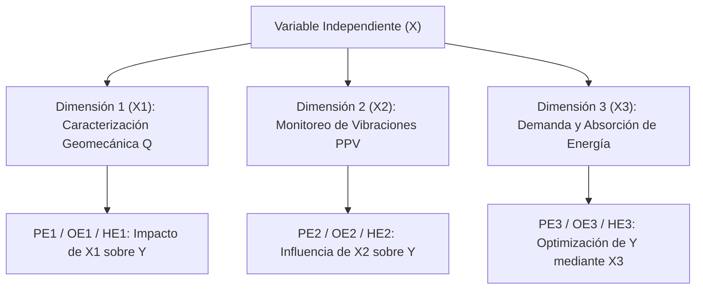

# 🎯 Deducción de Problemas, Objetivos e Hipótesis

El núcleo lógico del plan de tesis descansa en la **tríada de consistencia**. Cada componente de la tríada debe responder con precisión matemática a los otros dos.


---

## 1. Nivel General: La Relación Causal Principal

El nivel general sintetiza toda la investigación integrando la Variable Independiente ($X$) y la Variable Dependiente ($Y$) en la Unidad de Análisis ($U$):

| Elemento | Estructura Lingüística Formal | Plantilla Canónica UNI FIGMM |
| :--- | :--- | :--- |
| **Problema General (PG)** | Pregunta abierta de relación causal o de optimización. | *¿En qué medida la [Variable Independiente X] optimiza/influye en la [Variable Dependiente Y] en [Unidad de Estudio]?* |
| **Objetivo General (OG)** | Verbo de acción de máximo nivel cognitivo + resultado esperado. | *Determinar/Optimizar la influencia de la [Variable Independiente X] sobre la [Variable Dependiente Y] en [Unidad de Estudio].* |
| **Hipótesis General (HG)** | Proposición condicional afirmativa contrastable. | *La aplicación/integración de la [Variable Independiente X] optimiza significativamente la [Variable Dependiente Y] en [Unidad de Estudio].* |

---

## 2. Los Dos Métodos Canónicos para Deducir los Específicos

Según la **Dra. Rosario Martínez**, los problemas, objetivos e hipótesis específicos **NUNCA se inventan aisladamente**. Existen únicamente dos métodos metodológicos válidos para derivarlos:

### Método A: Descomposición por Dimensiones de la Variable Independiente ($X$)
Se descompone la Variable Independiente ($X$) en sus dimensiones esenciales ($X_1, X_2, X_3$) y se evalúa su impacto directo sobre la Variable Dependiente ($Y$):



### Método B: Descomposición por Fases Secuenciales de la Ingeniería Aplicada
Especialmente utilizado en tesis tecnológicas, proyectos de diseño y modelos computacionales. Sigue la secuencia del método ingenieril:

1. **Fase 1 (Diagnóstico / Línea Base):** Caracterizar el estado inicial del macizo rocoso o proceso.
2. **Fase 2 (Modelamiento / Simulación / Algoritmo):** Diseñar, formular y calibrar el modelo analítico o sistema técnico propuesto.
3. **Fase 3 (Evaluación de Impacto / Validación):** Evaluar el desempeño técnico, operativo, económico y de seguridad del sistema optimizado.

---

## 3. Matriz de Correspondencia Biunívoca 1:1

A continuación se presenta la tabla que rige el diseño de los 3 niveles específicos:

| Nivel | Problema (Pregunta) | Objetivo (Verbo en Infinitivo) | Hipótesis (Proposición Afirmativa) |
| :--- | :--- | :--- | :--- |
| **Específico 1** *(Diagnóstico / Dimensión 1)* | **PE1:** ¿De qué manera la caracterización geomecánica mediante el Sistema Q de Barton condiciona la zonificación y demanda de sostenimiento en las labores de avance? | **OE1:** **Caracterizar** las propiedades geomecánicas del macizo rocoso mediante el Sistema Q de Barton para zonificar los sectores críticos de la labor. | **HE1:** La caracterización geomecánica mediante el Sistema Q de Barton permite zonificar con alta resolución los tramos con alto factor de esfuerzos (SRF). |
| **Específico 2** *(Dinámica / Dimensión 2)* | **PE2:** ¿Cómo influyen los niveles de velocidad pico de partícula (PPV) generados por voladura en el esfuerzo dinámico transitorio perimetral? | **OE2:** **Determinar** la ley de atenuación de vibraciones y cuantificar el esfuerzo dinámico transitorio inducido por el campo de PPV en el contorno. | **HE2:** La cuantificación del campo de vibraciones (PPV) permite predecir los esfuerzos dinámicos transitorios que superan la resistencia tensional del macizo. |
| **Específico 3** *(Optimización / Dimensión 3)* | **PE3:** ¿Cuál es la respuesta y capacidad de absorción de energía del sostenimiento dinámico para garantizar un factor de seguridad $FS \ge 1.50$? | **OE3:** **Evaluar y seleccionar** la combinación de sostenimiento dinámico (pernos deformables, mallas y FRS) que optimice el balance energético con $FS \ge 1.50$. | **HE3:** La selección del sostenimiento dinámico basada en balance energético garantiza una absorción superior a la demanda dinámica, asegurando un factor de seguridad $FS \ge 1.50$. |

---

## 4. Taxonomía de Verbos de Acción para Ingeniería de Minas

La Dra. Rosario Martínez y la escuela de la UNI enfatizan el uso riguroso de la taxonomía cognitiva:

```
                  [NIVEL 4: EVALUACIÓN Y OPTIMIZACIÓN]
                       Optimizar, Evaluar, Validar
                                   ▲
                                   │
                  [NIVEL 3: MODELAMIENTO Y DISEÑO]
                   Formular, Modelar, Diseñar, Calcular
                                   ▲
                                   │
                  [NIVEL 2: ANÁLISIS Y COMPARACIÓN]
                   Analizar, Comparar, Determinar, Correlacionar
                                   ▲
                                   │
                  [NIVEL 1: DIAGNÓSTICO Y EXPLORACIÓN]
                   Caracterizar, Diagnosticar, Identificar
```

> [!CAUTION]
> **Compuerta de Calidad:** Si un agente de IA genera un objetivo como *"Realizar ensayos de laboratorio"*, *"Tomar datos de campo"* o *"Estudiar el sostenimiento"*, el plan debe ser rechazado inmediatamente. Los objetivos representan **metas de conocimiento**, no tareas de agenda.
