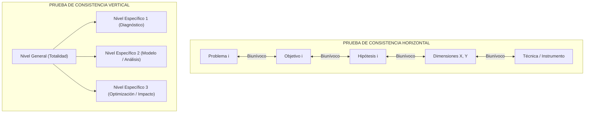

# 📐 Arquitectura de la Matriz de Consistencia (5x4)

La **Matriz de Consistencia** es la radiografía metodológica integral de la tesis. En una sola tabla de 5 columnas por 4 filas principales, sintetiza la totalidad del proyecto científico.

---

## 1. La Cuadrícula Canónica 5x4 (UNI FIGMM)

```
┌─────────────────┬─────────────────┬─────────────────┬─────────────────┬─────────────────┐
│ 1. PROBLEMAS    │ 2. OBJETIVOS    │ 3. HIPÓTESIS    │ 4. VARIABLES    │ 5. METODOLOGÍA  │
├─────────────────┼─────────────────┼─────────────────┼─────────────────┼─────────────────┤
│ Problema        │ Objetivo        │ Hipótesis       │ Variable        │ Tipo y Nivel    │
│ General (PG)    │ General (OG)    │ General (HG)    │ Independiente   │ de Investigación│
│                 │                 │                 │ (X)             │                 │
├─────────────────┼─────────────────┼─────────────────┼─────────────────┼─────────────────┤
│ Problema        │ Objetivo        │ Hipótesis       │ Variable        │ Diseño de       │
│ Específico 1    │ Específico 1    │ Específica 1    │ Dependiente     │ Investigación   │
│ (PE1)           │ (OE1)           │ (HE1)           │ (Y)             │                 │
├─────────────────┼─────────────────┼─────────────────┼─────────────────┼─────────────────┤
│ Problema        │ Objetivo        │ Hipótesis       │ Variables       │ Población       │
│ Específico 2    │ Específico 2    │ Específica 2    │ Intervinientes  │ y Muestra       │
│ (PE2)           │ (OE2)           │ (HE2)           │ (Z)             │                 │
├─────────────────┼─────────────────┼─────────────────┼─────────────────┼─────────────────┤
│ Problema        │ Objetivo        │ Hipótesis       │ Indicadores     │ Técnicas e      │
│ Específico 3    │ Específico 3    │ Específica 3    │ Clave           │ Instrumentos    │
│ (PE3)           │ (OE3)           │ (HE3)           │                 │ de Campo        │
└─────────────────┴─────────────────┴─────────────────┴─────────────────┴─────────────────┘
```

---

## 2. Pruebas de Consistencia Lógica

Para certificar que una matriz de consistencia es inatacable ante un jurado calificador de la UNI FIGMM, debe superar dos pruebas vectoriales:



### A. Prueba de Consistencia Horizontal (Coherencia Biunívoca):
* Cada fila debe responder al mismo problema ontológico.
* Si el **PE2** pregunta por la *velocidad pico de partícula (PPV)* y su efecto en el esfuerzo dinámico, el **OE2** DEBE tener como verbo rector *determinar o modelar el PPV*, y la **HE2** DEBE afirmar la *relación predictiva del PPV sobre el esfuerzo dinámico*.
* **Falla típica:** Cambiar de tema a mitad de fila (ej. que el problema pregunte por vibraciones y el objetivo hable de costos económicos).

### B. Prueba de Consistencia Vertical (Exhaustividad y No Redundancia):
* La suma de los tres niveles específicos debe agotar completamente el alcance del nivel general:
  $$\sum_{i=1}^{3} \text{Específico}_i \equiv \text{General}$$
* Ningún específico puede salirse de las fronteras fijadas en el nivel general, ni pueden existir dos específicos que investiguen lo mismo con palabras distintas.

---

## 3. Matriz de Consistencia Completa (Caso Maestro Lincuna)

| Problemas | Objetivos | Hipótesis | Variables e Indicadores | Metodología |
| :--- | :--- | :--- | :--- | :--- |
| **Problema General (PG):**<br>¿De qué manera la aplicación del Sistema Q de Barton y el monitoreo de vibraciones permite optimizar la selección del sostenimiento dinámico para labores subterráneas en una unidad minera del centro del Perú, 2026? | **Objetivo General (OG):**<br>Optimizar la selección del sostenimiento dinámico mediante la integración analítica del Sistema Q de Barton y el monitoreo de vibraciones inducidas en labores subterráneas del centro del Perú, 2026. | **Hipótesis General (HG):**<br>La aplicación integrada del Sistema Q de Barton y el monitoreo de vibraciones optimiza significativamente la selección del sostenimiento dinámico, garantizando un balance energético con factor de seguridad $FS_{\text{dinámico}} \ge 1.50$. | **Variable Independiente ($X$):**<br>- Dimensión 1: Calidad Geomecánica ($RQD$, $J_r/J_a$, $SRF$, $Q$).<br>- Dimensión 2: Dinámica de Vibraciones ($PPV$, $f_d$, $\sigma_d$).<br><br>**Variable Dependiente ($Y$):**<br>- Dimensión 1: Demanda Energética ($E_k$, $d$).<br>- Dimensión 2: Capacidad Disipativa ($E_{\text{perno}}$, $E_{\text{malla}}$, $FRS$).<br>- Dimensión 3: Confiabilidad ($FS_{\text{dinámico}}$). | **Tipo de Investigación:**<br>Aplicada y tecnológica.<br><br>**Nivel:**<br>Explicativo - Cuantitativo.<br><br>**Diseño de Investigación:**<br>Cuasi-experimental y longitudinal.<br><br>**Población:**<br>Total de disparos de avance y tramos excavados en niveles profundos de la unidad minera.<br><br>**Muestra:**<br>Muestreo no probabilístico intencional de 35 frentes de avance instrumentados.<br><br>**Técnicas e Instrumentos:**<br>- Mapeo geomecánico de celda y sondeos.<br>- Sismógrafos triaxiales Instantel (PPV).<br>- Ensayos de laboratorio (ASTM D7012, ASTM C1550).<br>- Algoritmos de balance en Python. |
| **Problema Específico 1 (PE1):**<br>¿De qué manera la caracterización geomecánica mediante el Sistema Q de Barton condiciona la zonificación y demanda preliminar de soporte en las labores de avance? | **Objetivo Específico 1 (OE1):**<br>Caracterizar las propiedades geomecánicas del macizo rocoso mediante el Sistema Q de Barton para zonificar los sectores críticos y tramos con alto factor de esfuerzo ($SRF$). | **Hipótesis Específica 1 (HE1):**<br>La caracterización geomecánica mediante el Sistema Q de Barton permite zonificar con alta resolución los tramos con $SRF \ge 5.0$ propensos a desprendimiento dinámico. | **Variables Intervinientes ($Z$):**<br>- Resistencia de roca intacta ($\sigma_c$, $E_d$).<br>- Campo tensional inducido ($\sigma_1$, $\sigma_3$).<br>- Anisotropía estructural del macizo. | |
| **Problema Específico 2 (PE2):**<br>¿Cómo influyen los niveles de velocidad pico de partícula ($PPV$) generados por voladura en el esfuerzo dinámico transitorio y degradación perimetral del macizo? | **Objetivo Específico 2 (OE2):**<br>Determinar la ley de atenuación de vibraciones y cuantificar el esfuerzo dinámico transitorio ($\sigma_d$) inducido por el campo de $PPV$ en el contorno de la excavación. | **Hipótesis Específica 2 (HE2):**<br>La calibración del modelo de atenuación permite predecir niveles de $PPV > 350\text{ mm/s}$ que inducen esfuerzos dinámicos superiores a la resistencia tensional del macizo. | | |
| **Problema Específico 3 (PE3):**<br>¿Cuál es la respuesta mecánica y capacidad de absorción de energía de la combinación de pernos dinámicos, mallas de alta resistencia y shotcrete con fibra? | **Objetivo Específico 3 (OE3):**<br>Evaluar y seleccionar la combinación de elementos de soporte dinámico (D-Bolt, mallas de alta tenacidad y FRS) que optimice la disipación de energía ante la demanda sísmica. | **Hipótesis Específica 3 (HE3):**<br>La combinación de pernos deformables D-Bolt, malla romboidal de alta tenacidad y FRS disipa demandas de energía $> 25\text{ kJ/m}^2$, asegurando $FS_{\text{dinámico}} \ge 1.50$. | | |

---

## 4. Compuertas de Calidad (Quality Gates)

Antes de dar por válida la matriz, el agente debe verificar el cumplimiento del 100% de la siguiente lista de verificación:

- [x] El **Problema General** incluye explícitamente la Variable Independiente, la Variable Dependiente y la Unidad de Análisis.
- [x] Los **Objetivos** inician con verbos en infinitivo taxonómico y expresan aportes científicos (cero tareas operativas).
- [x] Existe **correspondencia biunívoca exacta (1:1)** entre cada fila de problemas, objetivos e hipótesis.
- [x] Las **Variables** están desglosadas en dimensiones cuantificables e indicadores en unidades físicas estándar.
- [x] La columna de **Metodología** detalla Tipo, Nivel, Diseño, Población, Muestra e Instrumentación formal.
