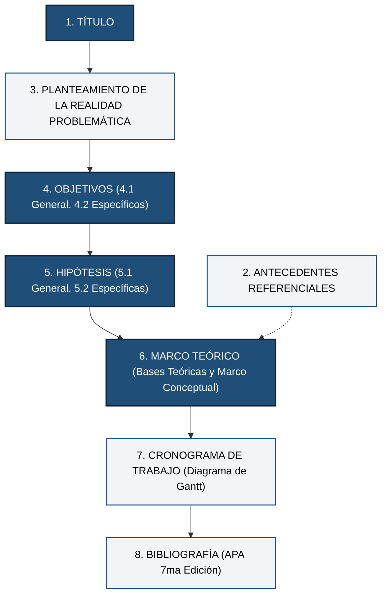

# 📋 Guía Normativa: Plan de Tesis Formato 1 (UNI FIGMM)

Conforme al Reglamento General de Grados y Títulos de la Universidad Nacional de Ingeniería (**RR 371-2016** y su actualización institucional **RR 1439-2023**), la inscripción y aprobación formal del proyecto de tesis ante la Comisión de Grados y Títulos de la **FIGMM** requiere la presentación del expediente oficial bajo el **Formato N° 1**.

---

## 1. Composición del Expediente Formato N° 1

El expediente presentado por mesa de partes está conformado por:
1. **Solicitud Formato N° 1:** Dirigida al Señor Decano de la FIGMM, consignando los datos del bachiller (Código UNI, DNI, Escuela Profesional de Minas, Geología o Metalurgia) y el título formal propuesto.
2. **Cuerpo del Plan de Tesis:** Documento académico estructurado estrictamente bajo los **8 ítems reglamentarios** aprobados por el Consejo de Facultad.

---

## 2. Los 8 Ítems Reglamentarios del Plan de Tesis

---

## 3. Desarrollo Detallado Ítem por Ítem

### Ítem 1: Título de la Tesis
* Debe cumplir la fórmula canónica: $[X] + [Y] + [\text{Unidad de Estudio}] + [\text{Delimitación Temporal}]$.
* Conciso, técnico, sin abreviaturas no universales.

### Ítem 2: Antecedentes Referenciales
* Síntesis de investigaciones de los **últimos 5 a 8 años** indexadas en Scopus, Web of Science o repositorios institucionales de posgrado (UNI, UNMSM, etc.).
* Estructuración obligatoria en tres niveles geográficos:
  1. **Internacionales:** Mínimo 3 a 5 investigaciones canónicas de clase mundial.
  2. **Nacionales:** Mínimo 3 investigaciones en operaciones mineras peruanas.
  3. **Locales / Cátedras UNI:** Tesis previas de la Sección de Posgrado FIGMM.
* Cada antecedente debe resumir: *Autor(es), año, objetivo, metodología, aporte principal y cómo se relaciona con la presente tesis*.

### Ítem 3: Planteamiento de la Realidad Problemática
* **Diagnóstico de la situación actual:** Describir la operación minera y las condiciones geomecánicas adversas (profundización, litología, altos esfuerzos).
* **El Problema Central y Brecha Tecnológica:** Qué limitación existe en los métodos tradicionales (ej. colapso de pernos rígidos ante vibraciones).
* **Causas Raíces y Consecuencias:** Diagrama de Ishikawa o sustentación con datos cuantitativos (toneladas de sobrerotura, costos de reparación, retrasos operativos).
* **Formulación de Problemas:**
  - **3.1. Problema General:** Formulación interrogativa abierta.
  - **3.2. Problemas Específicos:** Desglose tridimensional (PE1, PE2, PE3).

### Ítem 4: Objetivos
* **4.1. Objetivo General:** Inicia con verbo de acción (Determinar, Optimizar, Evaluar). Correspondencia biunívoca total con el Problema General.
* **4.2. Objetivos Específicos:** Tres objetivos específicos derivados biunívocamente de los problemas específicos (OE1, OE2, OE3).

### Ítem 5: Hipótesis
* **5.1. Hipótesis General:** Proposición afirmativa condicional que anticipa la solución y cuantifica la optimización.
* **5.2. Hipótesis Específicas:** Tres hipótesis específicas que responden a los objetivos específicos (HE1, HE2, HE3).

### Ítem 6: Marco Teórico
* Dividido obligatoriamente en dos partes:
  1. **Bases Teóricas:** Desarrollo matemático-físico profundo de las teorías que respaldan el estudio (Clasificación de Barton, ecuaciones de Navier-Cauchy, modelos de PPV de Holmberg-Persson, mecánica del perno D-Bolt de Charlie Li, balances energéticos de Kaiser y Ortlepp). Con ecuaciones en formato formal.
  2. **Marco Conceptual (Términos Básicos):** Definición rigurosa de los conceptos técnicos especializados para unificar criterios ontológicos (NO es un diccionario común, son términos especializados con dos párrafos: definición científica y contexto operativo en mina).

### Ítem 7: Cronograma de Trabajo
* Diagrama de Gantt formal proyectado a **6 o 12 meses**, organizado por etapas metodológicas:
  - Etapa 1: Revisión bibliográfica e ingesta de fuentes canónicas.
  - Etapa 2: Recolección y procesamiento de datos de campo en mina.
  - Etapa 3: Modelamiento numérico y balance analítico en Python.
  - Etapa 4: Contrastación de hipótesis y análisis de resultados.
  - Etapa 5: Redacción final del borrador y sustentación.

### Ítem 8: Bibliografía
* Referencias completas en estricto formato **APA 7ma Edición** con sangría francesa y orden alfabético.
* Incluir DOIs activos en artículos científicos y enlaces a repositorios institucionales.
