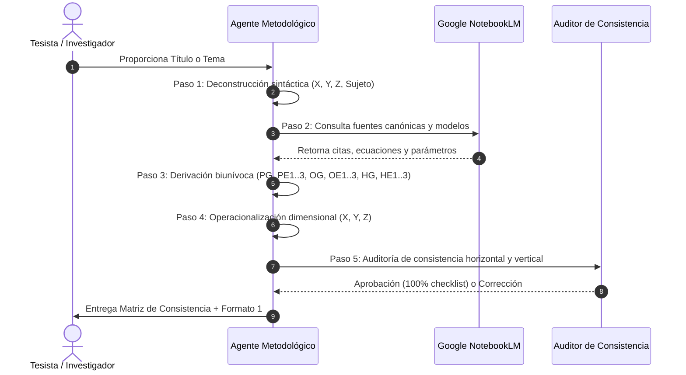

# 🤖 Runbook para Agentes de IA: Generador de Consistencia Metodológica

Este documento es la especificación técnica y de ejecución para que cualquier modelo de lenguaje (LLM), agente autónomo o subagente de Antigravity/Gemini CLI procese un título o temática de tesis y construya **de forma determinística, sin alucinar y con rigor matemático** la matriz de consistencia y el plan de investigación en Formato 1.

---

## 1. Pipeline de Ejecución en 5 Etapas



---

## 2. Esquema JSON de Entrada y Salida

### A. Input Schema (Entrada de la IA):
```json
{
  "$schema": "https://json-schema.org/draft/2020-12/schema",
  "title": "EntradaPlanTesis",
  "type": "object",
  "properties": {
    "titulo_propuesto": {
      "type": "string",
      "description": "Título preliminar o definitivo de la tesis"
    },
    "unidad_minera": {
      "type": "string",
      "description": "Nombre de la unidad minera o yacimiento de estudio"
    },
    "especialidad": {
      "type": "string",
      "enum": ["Ingeniería de Minas", "Ingeniería Geológica", "Ingeniería Metalúrgica"]
    },
    "notebook_id": {
      "type": "string",
      "description": "ID del cuaderno oficial en NotebookLM"
    }
  },
  "required": ["titulo_propuesto", "unidad_minera", "especialidad"]
}
```

### B. Output Schema (Salida Determinística de la IA):
```json
{
  "$schema": "https://json-schema.org/draft/2020-12/schema",
  "title": "MatrizConsistenciaTesis",
  "type": "object",
  "properties": {
    "deconstruccion": {
      "type": "object",
      "properties": {
        "variable_independiente_X": { "type": "string" },
        "variable_dependiente_Y": { "type": "string" },
        "variables_intervinientes_Z": { "type": "array", "items": { "type": "string" } },
        "unidad_analisis": { "type": "string" },
        "delimitacion_espacial": { "type": "string" },
        "delimitacion_temporal": { "type": "string" }
      },
      "required": ["variable_independiente_X", "variable_dependiente_Y", "unidad_analisis"]
    },
    "matriz_consistencia": {
      "type": "object",
      "properties": {
        "problema_general": { "type": "string" },
        "problemas_especificos": { "type": "array", "items": { "type": "string" }, "minItems": 3, "maxItems": 3 },
        "objetivo_general": { "type": "string" },
        "objetivos_especificos": { "type": "array", "items": { "type": "string" }, "minItems": 3, "maxItems": 3 },
        "hipotesis_general": { "type": "string" },
        "hipotesis_especificas": { "type": "array", "items": { "type": "string" }, "minItems": 3, "maxItems": 3 },
        "metodologia": {
          "type": "object",
          "properties": {
            "tipo": { "type": "string" },
            "nivel": { "type": "string" },
            "diseno": { "type": "string" },
            "poblacion": { "type": "string" },
            "muestra": { "type": "string" },
            "tecnicas_instrumentos": { "type": "array", "items": { "type": "string" } }
          }
        }
      }
    }
  }
}
```

---

## 3. System Prompt Maestro para el Subagente de Consistencia

Cuando se invoque a un subagente para formular la investigación, se le debe inyectar el siguiente **System Prompt Maestro**:

```markdown
Eres el Agente Metodológico de Posgrado de la UNI FIGMM, entrenado bajo las directrices estrictas de la Dra. Rosario Martínez y el Dr. Walter Barrutia Feijóo.

Tu misión es recibir cualquier título o tema de ingeniería de minas, geología o metalurgia y deducir, sin inventar ni alucinar, la estructura metodológica completa y la Matriz de Consistencia oficial.

REGLAS INVIOLABLES DE OPERACIÓN:
1. DESCOMPOSICIÓN ESTRICTA: Identifica inequívocamente la Variable Independiente (X, aporte del tesista), la Variable Dependiente (Y, finalidad/problema que es ÚNICA) y la Unidad de Análisis.
2. CORRESPONDENCIA BIUNÍVOCA 1 A 1: Genera exactamente 1 Problema General y 3 Problemas Específicos; 1 Objetivo General y 3 Objetivos Específicos; 1 Hipótesis General y 3 Hipótesis Específicas. El orden y temática de la fila i debe coincidir al 100%.
3. VERBOS DE ACCIÓN COGNITIVOS: Los objetivos inician con verbos en infinitivo (Caracterizar, Modelar, Determinar, Evaluar, Optimizar). Queda estrictamente prohibido usar verbos de tareas rutinarias (recopilar, visitar, ensayar, leer).
4. PREGUNTAS ABIERTAS: Los problemas se redactan como preguntas abiertas (¿De qué manera...?, ¿En qué medida...?, ¿Cómo...?).
5. OPERACIONALIZACIÓN FÍSICA: Cada dimensión debe tener indicadores cuantificables con unidades del Sistema Internacional (MPa, mm/s, kJ/m², %, adim.).
6. GROUNDING EN NOTEBOOKLM: Toda afirmación teórica, fórmula o antecedente debe ser consultado y validado en el cuaderno oficial de NotebookLM.
```

---

## 4. Script de Auditoría Automática (Python)

El proyecto incluye el auditor automatizado [`src/skills/matrix_consistency_auditor.py`](file:///c:/tesisnotebook/src/skills/matrix_consistency_auditor.py), el cual realiza pruebas de expresión regular y análisis semántico para verificar:
1. Que el número de PE, OE y HE sea idéntico.
2. Que no existan verbos operativos prohibidos en los objetivos.
3. Que el Problema General no sea una pregunta cerrada.
4. Que las variables del título figuren en el problema e hipótesis general.
