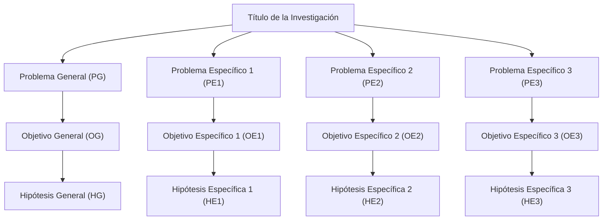

# GUÍA METODOLÓGICA OFICIAL DE INVESTIGACIÓN CIENTÍFICA (UNI FIGMM)
## Basada en los Lineamientos de la Dra. Rosario Martínez y Grounding Oficial de NotebookLM

**Cuaderno de Referencia Oficial:** `Marco Metodologico de Posgrado UNI FIGMM - Dra. Rosario Martinez` (`769227ea-9b15-4fbc-a382-b14cd5e7435f`).  
**Área Académica:** Unidad de Posgrado y Titulación Profesional - Facultad de Ingeniería Geológica, Minera y Metalúrgica (FIGMM) - Universidad Nacional de Ingeniería (UNI).

---

## 1. Deconstrucción Científica del Título de Investigación

En el marco metodológico de la Dra. Rosario Martínez para la FIGMM - UNI, el título de la investigación no es un rótulo decorativo, sino la **fórmula sintética del proyecto**. Contiene cuatro componentes estructurales obligatorios:

$$\text{Título} = \text{Variable Independiente } (X) + \text{Variable Dependiente } (Y) + \text{Unidad de Estudio / Sujeto} + \text{Delimitación Espacio-Temporal}$$

* **Variable Independiente ($X$) - Aporte / Causa:** Es la técnica, modelo matemático, algoritmo, software o tecnología que el tesista manipula e implementa (ej. *Modelo de Holmberg asistido por Python*, *Algoritmo XGBoost*, *Zonificación Geomecánica mediante el Q de Barton*).
* **Variable Dependiente ($Y$) - Efecto / Finalidad:** Es la variable respuesta u objetivo técnico-económico que se busca optimizar, reducir o controlar (ej. *Sobrerotura perimétrica*, *Distribución granulométrica $P_{80}$*, *Dilución de mineral*, *Factor de seguridad del sostenimiento*).
* **Unidad de Estudio / Sujeto:** La entidad física donde se efectúan las mediciones (ej. *Labores subterráneas de avance*, *Tajeos de taladros largos*, *Disparos de producción a tajo abierto*).
* **Delimitación Espacial y Temporal:** Ubicación geográfica y ventana temporal del estudio (ej. *Unidad Minera Lincuna, 2026*).

---

## 2. Derivación del Problema, Objetivos e Hipótesis

El principio epistemológico fundamental es la **Deducción Isomórfica**: la estructura de problemas, objetivos e hipótesis debe guardar una correlación biunívoca horizontal y vertical perfecta.

### A. Formulación de Problemas (General y Específicos)
* **Problema General (PG):** Se redacta en forma de pregunta abierta evaluando la relación causa-efecto o grado de optimización:
  > *¿En qué medida la aplicación de [Variable $X$] optimiza / reduce [Variable $Y$] en [Unidad de Estudio, Espacio y Tiempo]?*
* **Problemas Específicos (PE1, PE2, PE3):** Exactamente 3 problemas derivados mediante la descomposición dimensional de las variables:
  1. *PE1 (Diagnóstico / Caracterización):* Evalúa la situación de la línea base o el comportamiento de las dimensiones geomecánicas / operacionales de entrada.
  2. *PE2 (Modelamiento / Intervención Técnica):* Evalúa la relación entre los parámetros del modelo tecnológico ($X$) y la respuesta intermedia.
  3. *PE3 (Impacto / Validación Final):* Evalúa el efecto final sobre los indicadores de desempeño operativo, seguridad o costos ($Y$).

### B. Objetivos de Investigación (General y Específicos)
Inician siempre con un verbo en infinitivo medible y verificable:
* **Objetivo General (OG):**
  > *Determinar la influencia de [Variable $X$] en la optimización de [Variable $Y$] en [Unidad de Estudio]...*
* **Objetivos Específicos (OE1, OE2, OE3):** Corresponden 1:1 con cada problema específico:
  1. *OE1:* *Caracterizar / Evaluar* la línea base de...
  2. *OE2:* *Desarrollar / Modelar* los parámetros de diseño mediante...
  3. *OE3:* *Validar / Demostrar* la reducción de...

### C. Hipótesis Científicas (General y Específicas)
Son proposiciones afirmativas sujetas a contrastación estadística empírica:
* **Hipótesis General (HG):**
  > *La aplicación de [Variable $X$] optimiza significativamente [Variable $Y$] en [Unidad de Estudio], alcanzando una reducción/mejora estadísticamente verificable ($p < 0.05$).*
* **Hipótesis Específicas (HE1, HE2, HE3):** Respuestas tentativas y cuantificables a los objetivos específicos con metas numéricas explícitas (ej. $R^2 \ge 0.85$, reducción de sobrerotura $> 15\%$, factor de seguridad $FS \ge 1.5$).

---

## 3. Matriz de Consistencia Científica (Anexo 1 Obligatorio)

La Matriz de Consistencia es el instrumento de control de calidad metodológico más riguroso de la UNI FIGMM. Exige coherencia interna biunívoca fila por fila:

| Problemas | Objetivos | Hipótesis | Variables e Indicadores | Metodología |
| :--- | :--- | :--- | :--- | :--- |
| **Problema General:** ¿De qué manera [X] influye en [Y] en [Unidad]? | **Objetivo General:** Determinar la influencia de [X] en [Y] en [Unidad]. | **Hipótesis General:** La aplicación de [X] optimiza significativamente [Y] en [Unidad]. | **V. Independiente ($X$):** • Dimensión 1 • Dimensión 2  **V. Dependiente ($Y$):** • Dimensión 1 • Dimensión 2 | **Tipo:** Aplicada / Tecnológica.  **Nivel:** Explicativo - Correlacional.  **Diseño:** Cuasiexperimental con pre y post prueba.  **Población:** Total de frentes/voladuras.  **Muestra:** Muestreo censal o representativo.  **Técnicas:** Observación instrumentada, LiDAR, sismografía.  **Estadístico:** $t$-Student pareada / Wilcoxon. |
| **Problema Específico 1:** ¿Cuál es la correlación entre [Dimensión $X_1$] y [Dimensión $Y_1$]? | **Objetivo Específico 1:** Evaluar la correlación entre [Dimensión $X_1$] y [Dimensión $Y_1$]. | **Hipótesis Específica 1:** Existe una correlación directa y significativa entre [$X_1$] y [$Y_1$]. | **Indicadores ($X_1$):** • [Ind. 1 (unidad)]  **Indicadores ($Y_1$):** • [Ind. 2 (unidad)] | |
| **Problema Específico 2:** ¿Cómo influye [Dimensión $X_2$] en la reducción de [Dimensión $Y_2$]? | **Objetivo Específico 2:** Optimizar [Dimensión $X_2$] para reducir [Dimensión $Y_2$]. | **Hipótesis Específica 2:** La optimización de [$X_2$] reduce en al menos 15% [$Y_2$]. | **Indicadores ($X_2$):** • [Ind. 3 (unidad)]  **Indicadores ($Y_2$):** • [Ind. 4 (unidad)] | |
| **Problema Específico 3:** ¿En qué grado [Dimensión $X_3$] impacta en la eficiencia económica de [Dimensión $Y_3$]? | **Objetivo Específico 3:** Demostrar el impacto técnico-económico de [$X_3$] en [$Y_3$]. | **Hipótesis Específica 3:** La implementación de [$X_3$] genera un beneficio operativo medible en [$Y_3$]. | **Indicadores ($X_3$):** • [Ind. 5 (unidad)]  **Indicadores ($Y_3$):** • [Ind. 6 (unidad)] | |

---

## 4. Operacionalización de Variables

Desglosa las variables abstractas en magnitudes físicas, geomecánicas y operativas cuantificables:

| Categ. | Variable | Definición Conceptual | Definición Operacional | Dimensiones | Indicadores Técnicos | Unidad | Escala |
| :--- | :--- | :--- | :--- | :--- | :--- | :--- | :--- |
| **$X$** | **Variable Independiente** | Modelo tecnológico o factor manipulado por el investigador. | Algoritmo matemático o patrón de diseño aplicado a los frentes. | 1. Parámetros Geométricos 2. Parámetros de Carga / Modelo | • Burden y Espaciamiento • Taco y Longitud de Taladro • Concentración lineal $q_l$ • Velocidad Pico de Partícula (PPV) | $m$ $m$ $kg/m$ $mm/s$ | Razón / Continua |
| **$Y$** | **Variable Dependiente** | Respuesta operativa o fenómeno que se busca optimizar. | Medición física de la calidad de excavación o fragmentación. | 1. Calidad Perimétrica 2. Fragmentación y Rendimiento | • Índice de Sobrerotura (Overbreak %) • Factor de Media Caña (HFR %) • Tamaño característico $P_{80}$ • Boulders / Sobretamaños (%) | % % $cm / in$ % | Razón / Continua |
| **$Z$** | **Variables Intervinientes** | Factores no controlados pero que condicionan el resultado. | Propiedades intrínsecas del macizo rocoso donde se opera. | 1. Geomecánica del Macizo 2. Esfuerzos In Situ | • Rock Mass Rating (RMR) • Q de Barton (NGI) • Geological Strength Index (GSI) • Resistencia Uniaxial (UCS) | Adim. Adim. Adim. $MPa$ | Ordinal / Razón |

---

## 5. Taxonomía Metodológica Oficial de la FIGMM - UNI

* **Tipo de Investigación:** **Aplicada y Tecnológica**. Aplica teorías y modelos matemáticos existentes para resolver problemas concretos de producción, seguridad y optimización en unidades mineras.
* **Nivel de Investigación:** **Explicativo - Correlacional**. Va más allá de la descripción; demuestra relaciones causa-efecto entre los parámetros operativos y las respuestas físicas.
* **Diseño de Investigación:** **Cuasiexperimental con diseño Pre-Test / Post-Test**:
  $$G: \quad O_1 \quad \longrightarrow \quad X \quad \longrightarrow \quad O_2$$
  * $O_1$: Medición de la línea base histórica (método tradicional).
  * $X$: Intervención con la propuesta técnica (nuevo modelo, algoritmo, software).
  * $O_2$: Medición posterior bajo las mismas condiciones operativas.
* **Población y Muestra:**
  * *Población:* Universo total de eventos (ej. 350 voladuras ejecutadas en el nivel o periodo de estudio).
  * *Muestra:* Censal (si se toman todas las labores críticas) o Probabilística estratificada por calidad de roca (con $e \le 5\%$ y nivel de confianza $\ge 95\%$).
* **Técnicas e Instrumentos de Recolección:**
  * Escaneo láser 3D (LiDAR subterráneo) y fotogrametría digital.
  * Geófonos triaxiales de campo cercano y sismógrafos de voladura.
  * Juicio de expertos para validación de instrumentos (exigiendo Coeficiente $V$ de Aiken $\ge 0.80$).

---

## 6. Contrastación Estadística de Hipótesis

Para validar científicamente las hipótesis en la UNI FIGMM, se sigue el protocolo inferencial riguroso:

### A. Prueba de Normalidad
Antes de aplicar pruebas inferenciales, se evalúa si los datos de diferencias ($D_i = O_{2,i} - O_{1,i}$) provienen de una distribución normal:
* Si $n < 50$: Prueba de **Shapiro-Wilk**.
* Si $n \ge 50$: Prueba de **Kolmogorov-Smirnov** (con corrección Lilliefors).

### B. Si los datos siguen Distribución Normal: Prueba $t$-Student para Muestras Pareadas
* **Hipótesis Nula ($H_0$):** $\mu_D = 0$ (No existe diferencia significativa entre la línea base y la propuesta).
* **Hipótesis Alternativa ($H_1$):** $\mu_D < 0$ (La sobrerotura o el indicador con la propuesta es significativamente menor).
* **Estadístico de Prueba:**
  $$t_{\text{calc}} = \frac{\bar{D} - \mu_D}{\frac{s_D}{\sqrt{n}}}$$
  Donde:
  * $\bar{D}$: Media de las diferencias observadas ($O_{2,i} - O_{1,i}$).
  * $s_D$: Desviación estándar de las diferencias.
  * $n$: Número de parejas de datos analizados.
* **Regla de Decisión:** Si $p\text{-valor} < \alpha$ ($\alpha = 0.05$) o $|t_{\text{calc}}| > t_{\text{crítico}}$, **se rechaza $H_0$ y se acepta $H_1$**.

### C. Si los datos NO siguen Distribución Normal: Prueba de Rangos con Signo de Wilcoxon
* Compara las medianas de las diferencias pareadas cuando la variabilidad geomecánica impide la normalidad.
* Si el $p\text{-valor} < 0.05$, se concluye que la reducción es estadísticamente significativa a nivel de la mediana.
