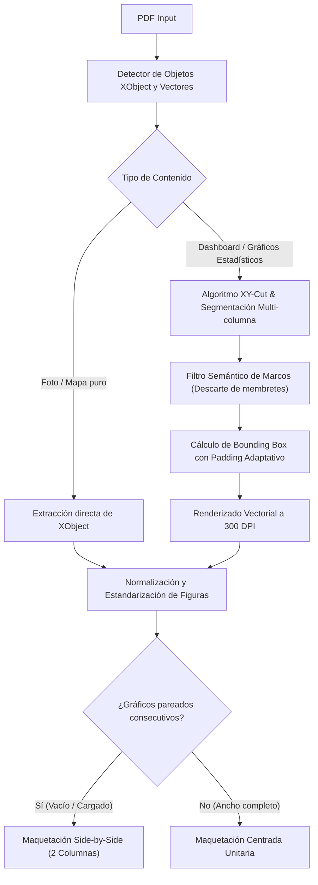

# ESTUDIO COMPARATIVO DE CALIDAD Y OPORTUNIDADES DE MEJORA EN EXTRACCIÓN DE IMÁGENES
**Sistema de Extracción Agéntica y Formateador Documental UNI**
**Autor:** Agente Antigravity (Google DeepMind Team) & Auditoría Humana Experta
**Fecha:** 2026-08-30

---

## 1. INTRODUCCIÓN Y DIAGNÓSTICO DEL PROBLEMA

Durante el proceso de formateo del informe de investigación *"Pesaje de Volquetes Gerencia Mina Cuajone 2025"*, se procesó un documento PDF originado a partir de capturas de dashboards de **Power BI Desktop**. Este tipo de documentos presenta una estructura híbrida compleja:
1. **Elementos rasterizados puros:** Fotografías de campo (motoniveladora, rodillo, volquetes, tolvas).
2. **Tablas y mapas vectoriales/rasterizados:** Tablas de personal, mapas satelitales.
3. **Gráficos estadísticos dinámicos con texto seleccionable:** Gráficos de barras, distribuciones posicionales, histogramas de ejes y tablas VIMS/PLM generadas por el motor de renderizado de Power BI.

### Síntomas y Errores Detectados en la Extracción Algorítmica Inicial:
- **Corte de bordes inferiores:** En gráficos de barras (figuras 23 en adelante), el algoritmo tomaba como límite inferior la última línea de texto del eje $x$, cortando la base del marco del gráfico.
- **Captura de artefactos ajenos al gráfico:** En las páginas 8 a 12, el algoritmo inicial capturó las líneas divisorias horizontales de los títulos o membretes de Power BI creyendo que eran los bordes superiores de las imágenes.
- **Falta de desagregación de sub-gráficos en paralelo:** En las páginas 18 a 21, donde coexistían dos gráficos de barras (condición vacía vs cargada) organizados en dos columnas paralelas, el algoritmo inicial extrajo la fila completa como una sola imagen ancha en lugar de generar dos gráficos independientes (figuras 35 a 48).

---

## 2. ANÁLISIS COMPARATIVO: ALGORITMO PRELIMINAR VS. CORRECCIÓN MANUAL HUMANA

A continuación, se detalla la matriz de contraste entre lo extraído automáticamente por el algoritmo inicial y el catálogo optimizado por la intervención humana experta:

| Categoría de Elemento | Comportamiento Algoritmo Inicial | Corrección Manual Humana (Ground Truth) | Causa Raíz Técnica |
| :--- | :--- | :--- | :--- |
| **Fotos Puras de Campo (Fig. 1-6)** | Extracción de imágenes raw individuales limpia. | Validación y aprobación directa. | Los objetos XObject de tipo Image en el PDF estaban bien delimitados. |
| **Cuadros de Tolvas (Fig. 9, 11, 13, 15, 17, 19, 22)** | Extracción limpia de fotos con separación de especificaciones. | Aprobado con mantenimiento de cuadro comparativo dual. | Correcta segmentación de párrafos y metadatos. |
| **Gráficos de Barras Simples (Fig. 7, 8, 10, 12, 14, 16, 18, 20, 21)** | Bounding boxes con desfase de 10-15 pt en la base y captura parcial de títulos. | Recorte ajustado exactamente al rectángulo del gráfico sin títulos externos. | Confusión entre `line_art` de títulos y marco exterior del gráfico. |
| **Distribución por Eje / Volquete (Fig. 33 a 48)** | Unificación de gráficos en una sola tira ancha; omisión de sub-figuras intermedias (37, 38, 40, etc.). | Desagregación individual de 14 figuras (`figura_35.png` a `figura_48.png`) de 2 en 2 (vacío / cargado). | El algoritmo no detectaba la división vertical (columna izquierda vs columna derecha) en la página. |
| **Gráficos de Correlación VIMS (Fig. 50 a 54)** | Desfase vertical en tablas de datos de error porcentual. | Recorte de alta fidelidad incluyendo tabla de diferencias numéricas. | Bounding box insuficiente para capturar la tabla de texto bajo la barra. |

---

## 3. IDENTIFICACIÓN DE OPORTUNIDADES DE MEJORA PARA EL ALGORITMO

Para que el agente inteligente replique en el futuro la exactitud del operador humano de forma 100% autónoma, se identifican las siguientes 5 áreas de mejora arquitectónica:

### 3.1. Detección Inteligente de Layout Multi-Columna en Dashboards
- **Problema:** En páginas de dashboards (como Power BI), un bloque de página puede contener 2 gráficos independientes dispuestos lado a lado (e.g., Izquierda: Vacío, Derecha: Cargado).
- **Solución Algorítmica:** Implementar un analizador de proyecciones horizontales y verticales (Recursive XY-Cut Algorithm) para detectar canales en blanco verticales y separar automáticamente los sub-gráficos en elementos individuales `A` y `B`.

### 3.2. Filtro Semántico de Líneas Divisoras vs. Marcos de Gráficos
- **Problema:** Las líneas decorativas de títulos (`height = 1 pt`, `width > 400 pt`) eran detectadas como el borde superior de la figura.
- **Solución Algorítmica:** Clasificar los vectores `line_art` según su aspecto:
  * Línea aislada sin cierre rectangular $\rightarrow$ Descartar (es línea de membrete/título).
  * 4 segmentos cerrados formando un polígono rectangular con área $> 15,000\text{ pt}^2$ $\rightarrow$ Validar como marco de gráfico.

### 3.3. Padding Adaptativo Dinámico en Gráficos con Ejes
- **Problema:** Los gráficos de barras tienen etiquetas en el eje horizontal ($x$) con rotación o deltas numéricos que sobresalen del bounding box inferido.
- **Solución Algorítmica:** Aplicar un padding vertical inferior dependiente de la tipografía detectada:
  $$\text{Margin}_{\text{bottom}} = \max(15\text{ pt}, 1.5 \times \text{FontSize}_{\text{labels}})$$

### 3.4. Detección Híbrida de Texto Seleccionable vs. Contenido Gráfico
- **Problema:** Si el texto dentro de un gráfico es seleccionable, los algoritmos tradicionales de maquetación intentan extraerlo como párrafo normal del informe, destruyendo la visualización.
- **Solución Algorítmica:** Si la densidad de fragmentos de texto con posiciones no alineadas verticalmente excede el umbral $\delta > 0.4$, clasificar todo el bloque rectangular como **Entidad Gráfica Completa** y renderizarla a 300 DPI en lugar de extraer texto plano.

### 3.5. Disposición Automatizada en Parejas Lado a Lado (Side-by-Side Layout)
- **Problema:** Insertar imágenes pequeñas de ancho completo genera pixelado y páginas innecesarias.
- **Solución Algorítmica:** Si el ratio de aspecto de dos figuras consecutivas es similar y pertenecen al mismo contexto (e.g., Vacío vs Cargado), el maquetador debe agruparlas automáticamente en una fila con tabla invisible de 2 columnas (`add_figure_pair`).

---

## 4. PROPUESTA DE ARQUITECTURA PARA EL EXTRACTOR DE SIGUIENTE GENERACIÓN (v3)

---

## 5. CONCLUSIÓN Y VALOR DEL APRENDIZAJE

El ejercicio de corrección manual realizado sobre las 53 figuras del proyecto Cuajone ha provisto un conjunto de datos de validación (*Ground Truth*) de valor incalculable. Con las reglas derivadas de este análisis, el agente dispone de los fundamentos teóricos y heurísticos para evolucionar los pipelines de extracción de documentos científicos y mineros.
